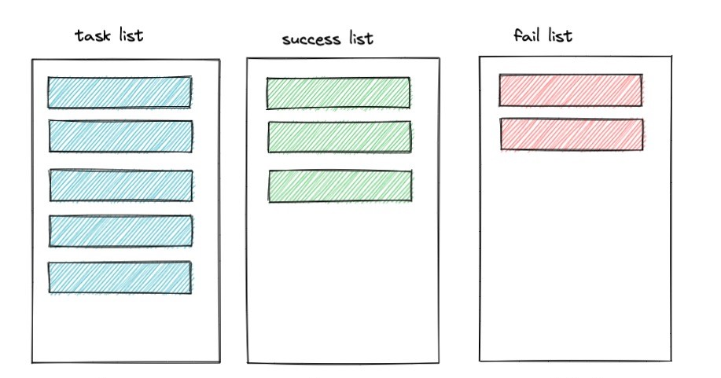

# Async Task



安装
```go
go get github.com/wanghaha-dev/asyncTask
```

简单使用
```go
package main

import (
	"context"
	"fmt"
	"log"

	"github.com/wanghaha-dev/asyncTask"
)

func main() {
	task, err := asyncTask.NewTask(context.Background(), asyncTask.Config{
		Addr:     "127.0.0.1:6379",
		DB:       0,
		Password: "",
	})
	if err != nil {
		panic(err)
	}

	// put task
	taskId, err := asyncTask.GenerateTaskId()
	if err != nil {
		log.Fatalln("generate taskId error!")
	}
	task.PutNormalTask(taskId, asyncTask.Map{
		"name": "task1",
		"date": asyncTask.Datetime(),
		"user": "1001",
	})

	// take task
	t1, err := task.TakeNormalTask()
	if err != nil {
		log.Fatalln("take normal task error:", err)
	}

	fmt.Println("take task is: ", t1)
	fmt.Println(t1["task_id"], t1["data"])
	fmt.Println(t1["data"].(map[string]interface{})["name"])
	jsonContext, err := t1.GetJSON()
	if err != nil {
		log.Fatalln("GetJson error: ", err)
	}
	fmt.Println(t1.GetJSON())
	// {"data":{"date":"2022-08-26 10:26:44","name":"task1","user":"1001"},"task_id":"03efb9e08b284642b5fd1ea11ae20341"}
	fmt.Println(asyncTask.JSONGet(jsonContext, "data.name"))
}
```


并发使用
```go
package main

import (
	"context"
	"fmt"
	"log"
	"sync"

	"github.com/wanghaha-dev/asyncTask"
)

func main() {
	task, err := asyncTask.NewTask(context.Background(), asyncTask.Config{
		Addr:     "127.0.0.1:6379",
		DB:       0,
		Password: "",
	})
	if err != nil {
		panic(err)
	}

	var wg sync.WaitGroup
	wg.Add(200)

	// put task
	go func() {
		asyncTask.Each(100, func() {
			taskId, err := asyncTask.GenerateTaskId()
			if err != nil {
				log.Fatalln("generate taskId error!")
			}
			task.PutNormalTask(taskId, asyncTask.Map{
				"name": "task1",
				"date": asyncTask.Datetime(),
				"user": "1001",
			})

			wg.Done()
		})
	}()

	// take task
	go func() {
		asyncTask.Each(100, func() {
			t1, err := task.TakeNormalTask()
			if err != nil {
				log.Fatalln("take normal task error:", err)
			}

			fmt.Println("take task is: ", t1)

			wg.Done()
		})
	}()

	wg.Wait()
	fmt.Println("finish.")
}
```